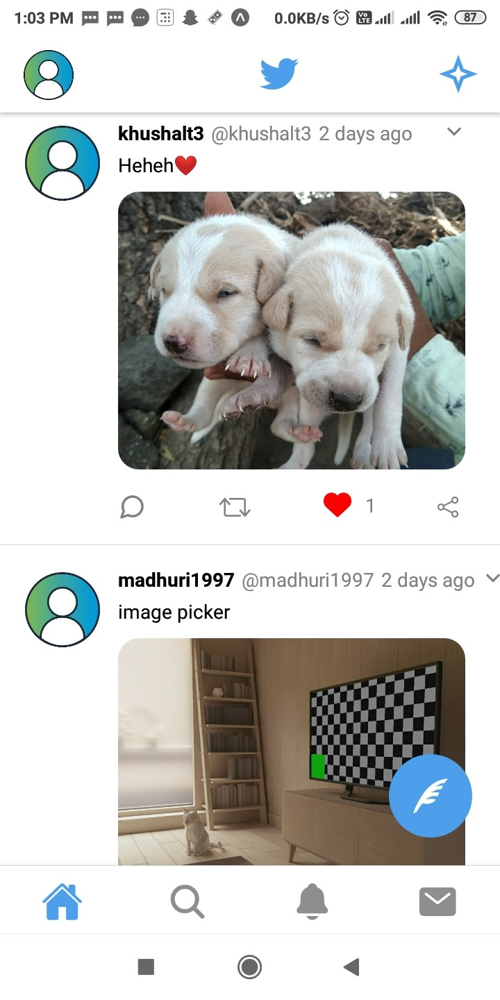
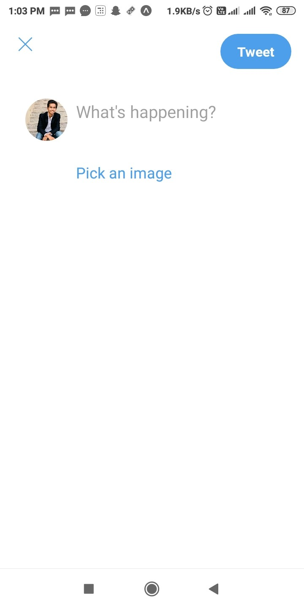

# React-Native-Twitter

both Android and Ios platform app access without downloading the app download expo-client app throught playstore on your mobile device and scan the QR code from this website https://expo.io/@khushalt10/TwitterApp

This is mini version of mobile twitter app where you can post, see a tweet with aws authentication.

To run the code on your machine

1.Clone the repository 2.npm install in both backend and quicksell folder 3.since backend is already hosted but to run on your localhost run command - node/nodemon index.js 4.to run frontend cd to quicksell folder and run command - npm start
4.then you will get QR code on browser which you can scan in expo app and run the code in development mode 5.remember to change the backend to your ip address and quicksell/app/config/setting.js

📋 Requirements React Native apps may target iOS 10.0 and Android 4.1 (API 16) or newer. You may use Windows, macOS, or Linux as your development operating system, though building and running iOS apps is limited to macOS. Tools like Expo can be used to work around this.

🎉 Building your first React Native app Follow the Getting Started guide. The recommended way to install React Native depends on your project. Here you can find short guides for the most common scenarios:

Trying out React Native Creating a New Application Adding React Native to an Existing Application 📖 Documentation The full documentation for React Native can be found on our website.

The React Native documentation discusses components, APIs, and topics that are specific to React Native. For further documentation on the React API that is shared between React Native and React DOM, refer to the React documentation.

The source for the React Native documentation and website is hosted on a separate repo, @facebook/react-native-website.

🚀 Upgrading Upgrading to new versions of React Native may give you access to more APIs, views, developer tools, and other goodies. See the Upgrading Guide for instructions.

React Native releases are discussed in the React Native Community, @react-native-community/react-native-releases.

👏 How to Contribute The main purpose of this repository is to continue evolving React Native core. We want to make contributing to this project as easy and transparent as possible, and we are grateful to the community for contributing bug fixes and improvements. Read below to learn how you can take part in improving React Native.

Code of Conduct Facebook has adopted a Code of Conduct that we expect project participants to adhere to. Please read the full text so that you can understand what actions will and will not be tolerated.

Contributing Guide Read our Contributing Guide to learn about our development process, how to propose bugfixes and improvements, and how to build and test your changes to React Native.

Open Source Roadmap You can learn more about our vision for React Native in the Roadmap.

Good First Issues We have a list of good first issues that contain bugs which have a relatively limited scope. This is a great place to get started, gain experience, and get familiar with our contribution process.

Discussions Larger discussions and proposals are discussed in @react-native-community/discussions-and-proposals.
